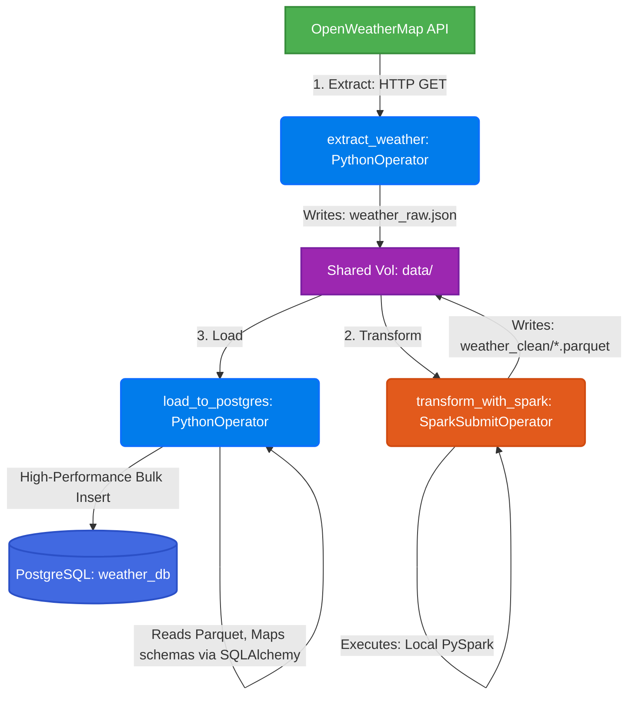

# Production-Grade Weather ETL Pipeline
### Modern Daily ETL Pipeline: OpenWeatherMap API ➔ Apache Airflow ➔ Local PySpark ➔ PostgreSQL (SQLAlchemy ORM)

<p align="center">
  
  
  
  
  
</p>

---

## Project Overview

This is a modern, production-ready, fully-dockerized daily Weather ETL (Extract, Transform, Load) data pipeline. It demonstrates industry-standard practices for orchestration, large-scale processing, object-relational mapping, and lightning-fast virtual environment management.



### Key Architectural Highlights
- **Apache Airflow Orchestration:** Automatically schedules and monitors daily jobs, with explicit failure retry limits and automated downstream skips.
- **Portability-First PySpark:** Uses PySpark in `local[*]` mode. This completely bypasses standalone Spark driver-worker Python version mismatch problems and utilizes native multi-threaded CPU processing.
- **SQLAlchemy ORM Model mapping:** Fully declared Postgres schemas with strict typing mapped through SQLAlchemy objects to deliver structured, transactional bulk-inserts.
- **Astral `uv` Package Management:** Drastically speeds up package resolution and image build cycles, backed by a declarative `pyproject.toml` and deterministic `uv.lock`.

---

## Project Structure

```
weather_etl_uv/
├── docker-compose.yml         # Defines all 5 containers (Postgres, Webserver, Scheduler, Spark)
├── Dockerfile                 # Extends Airflow image with Java, uv installer, and custom packages
├── pyproject.toml             # Declarative source of truth for Python dependencies
├── uv.lock                    # Deterministic, pinned package lockfile
├── .dockerignore              # Drastically reduces build context (430MB+ ➔ 174KB) for rapid builds
├── .env                       # API keys and container configuration profiles
│
├── dags/
│   └── weather_etl.py         # Airflow DAG containing model definitions and tasks
├── spark/
│   └── transform.py           # Portable PySpark cleaning and feature-engineering script
├── sql/
│   ├── init.sql               # Automatically triggers on Postgres boot to map databases and grants
│   └── queries.sql            # Analytical queries for exploring database entries
├── logs/                      # Mounted folder for Airflow task execution logs
├── data/                      # Shared storage volume for raw JSON and intermediate Parquet data
└── plugins/                   # Folder for extending Airflow capabilities
```

---

## Quick Start (Run in under 2 minutes)

### Step 1 — Prerequisites
Ensure you have the following installed on your machine:
- **Docker Desktop** (with Docker Compose)
- **OpenWeatherMap API Key** (Get a free key in 30 seconds at [openweathermap.org](https://openweathermap.org/api))

---

### Step 2 — Edit Configuration
Duplicate or open `.env` and fill in your details:
```ini
# OpenWeatherMap API Configuration
OPENWEATHER_API_KEY=your_openweathermap_api_key_here
WEATHER_CITY=Phnom Penh
```

---

### Step 3 — Fire Up the Infrastructure
Start your entire cluster with a single command:
```bash
docker compose up --build -d
```
> [!NOTE]
> Thanks to our optimized `.dockerignore` mapping, the build context is only **~174KB** and mounts are completely cached, meaning initialization completes in seconds.

Verify that all systems are running and healthy:
```bash
docker compose ps
```

---

### Step 4 — Run and Monitor the Pipeline
You can trigger and check the status of your tasks directly from your CLI:

```bash
# 1. Trigger the DAG
docker exec etl_airflow_scheduler airflow dags trigger weather_etl_pipeline

# 2. Check task execution logs
docker exec etl_airflow_scheduler airflow dags list-runs -d weather_etl_pipeline

# 3. List individual task execution states
docker exec etl_airflow_scheduler airflow tasks states-for-dag-run weather_etl_pipeline manual__YOUR_RUN_ID
```

You can also navigate to the elegant Airflow Webserver UI at **[http://localhost:8080](http://localhost:8080)** (User: `admin` / Password: `admin`) to view the interactive DAG visualization graph.

---

## Querying the Loaded Data

Once loaded, records are automatically mapped using SQLAlchemy and pushed to the persistent Postgres database. Connect via **DBeaver**, **TablePlus**, or run a terminal query directly:

```bash
docker exec -it etl_postgres psql -U weather -d weather_db -c "SELECT * FROM weather_data;"
```

#### Sample Database Entry:
| id | city | temp_c | feels_like | humidity | pressure | wind_speed | description | heat_index | recorded_at | loaded_at |
|---|---|---|---|---|---|---|---|---|---|---|
| 1 | Phnom Penh | 33.6 | 36.4 | 76 | 1008 | 2.80 | few clouds | hot | 2026-05-10 16:40 | 2026-05-10 16:41 |

---

## Local Virtual Environment Management with `uv`

If you are developing or testing files locally on your machine, `uv` provides exceptionally fast development environments:

```bash
# 1. Create a virtual environment and lock identical versions
uv sync

# 2. Sync optional development and PySpark environments
uv sync --extra spark --extra dev

# 3. Run Ruff code quality checks
uv run ruff check .

# 4. Run tests instantly
uv run pytest
```

---

## Production Configurations & Services

| Service | Access URL | Port | Credentials | Purpose |
|---|---|---|---|---|
| **Airflow Webserver** | [http://localhost:8080](http://localhost:8080) | `8080` | `admin` / `admin` | Dag orchestration UI & Monitoring |
| **PostgreSQL DB** | `localhost:5432` | `5432` | `weather` / `weather` | Target Data Warehouse (`weather_db`) |
| **Spark UI** | [http://localhost:4040](http://localhost:4040) | `4040` | *None* | Spark driver task performance graph |

---

## Tear Down & Reset
To stop services while keeping your database entries safe:
```bash
docker compose down
```

To run a complete clean reset and erase all volumes/tables:
```bash
docker compose down -v
```

---

<p align="center">
  Made with passion for high-performance data engineering pipelines.
</p>
